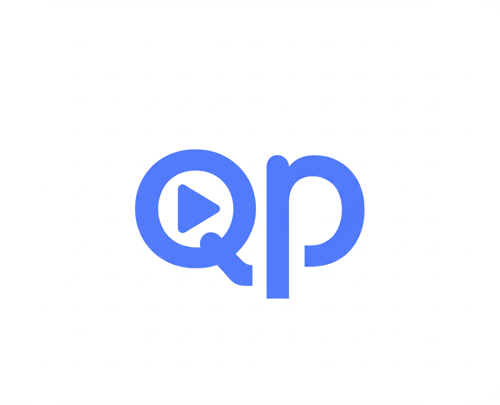

# QualPlay

Uma aplicação web moderna e completa para descobrir, explorar e analisar filmes, nascida de um experimento em Python e evoluída para uma arquitetura robusta com o auxílio de Inteligência Artificial.



## 📖 A História do Projeto: Uma Jornada de Ideias e IA

O **QualPlay** é mais do que um buscador de filmes; é o resultado de uma jornada de colaboração, aprendizado e da sinergia entre a inteligência humana e a artificial.

### O Início: A Prova de Conceito em Python

Tudo começou com uma conversa no WhatsApp com o amigo **Caio Azevedo**, que explorava o uso de IA Generativa para criar um buscador de filmes. Após uma troca de ideias sobre engenharia de prompt, o que era um desafio se tornou um protótipo funcional:

-   **Em 20 minutos:** Uma primeira versão rodava no terminal, validando a lógica principal.
-   **Em 1 hora:** Uma interface gráfica básica, construída com **Python e Streamlit**, já estava no ar.

Essa Prova de Conceito (POC) inicial, embora simples, provou o potencial da ideia e serviu como a semente para algo maior. O projeto, no entanto, precisava de uma arquitetura mais escalável para ir além do protótipo e ficou em maturação por um tempo.

### A Evolução: A Virada de Chave com IA

Meses depois, em uma conversa com o amigo engenheiro de dados **Cezar Peixeiro**, a chave para a evolução do projeto foi descoberta: a plataforma **bolt.new**.

**Bolt** é um agente de desenvolvimento web baseado em IA que opera diretamente no navegador. Ele permite construir aplicações full-stack através de um ambiente de chat, onde o desenvolvedor guia a IA para gerar e modificar o código em tempo real.

Com o uso intensivo de engenharia de prompt e múltiplos refinamentos no `bolt.new`, foi possível realizar uma transformação completa na aplicação: **migrar de uma arquitetura baseada em Python/Streamlit para uma solução full-stack moderna com React, TypeScript e Vite.**

O resultado é a aplicação robusta e cheia de funcionalidades que você vê hoje, um testemunho do poder da IA quando utilizada como uma ferramenta para acelerar o aprendizado e o desenvolvimento.
O **QualPlay** é uma aplicação desenvolvida em React com TypeScript que oferece uma experiência rica e intuitiva para entusiastas de cinema. A aplicação combina funcionalidades avançadas de busca, visualização de dados e uma interface moderna e responsiva, proporcionando uma experiência completa para descobrir e analisar filmes.

### ✨ Principais Funcionalidades

- **🔍 Busca Avançada**: Pesquise múltiplos filmes e diretores simultaneamente com filtros por gênero, ano e critérios de ordenação
- **📊 Dashboard de Analytics**: 8 tipos diferentes de visualizações de dados com gráficos interativos
- **🎯 Sistema de Recomendação Inteligente**: 4 algoritmos diferentes (Inteligente, Qualidade, Em Alta, Recentes)
- **💾 Sistema de Filmes Salvos**: Salve seus filmes favoritos com exportação em PDF
- **📱 Interface Mobile-First**: Design responsivo que funciona perfeitamente em todos os dispositivos
- **📄 Upload de Listas**: Importe listas de filmes via arquivos .txt ou .csv
- **🎬 Informações Completas**: Sinopses, elenco, diretor, avaliações e disponibilidade em streaming
- **📈 Exportação PDF**: Gere relatórios profissionais dos resultados de busca
- **🌐 Múltiplas Páginas**: Navegação entre busca, sobre e contato com formulário funcional

## 🚀 Tecnologias Utilizadas

### Frontend Core
- **React 18** - Biblioteca JavaScript para interfaces de usuário
- **TypeScript** - Superset do JavaScript com tipagem estática
- **Vite** - Build tool moderna e rápida
- **Tailwind CSS** - Framework CSS utilitário para design responsivo
- **Lucide React** - Biblioteca de ícones moderna e consistente

### Visualização de Dados
- **Chart.js** - Biblioteca para gráficos canvas (performance)
- **React Chart.js 2** - Wrapper React para Chart.js
- **Recharts** - Biblioteca de gráficos SVG para React (interatividade)
- **8 Tipos de Gráficos**: Barras, Pizza, Linha, Scatter, Radar, Area, Treemap, Box Plot

### APIs e Dados
- **The Movie Database (TMDB) API** - Base de dados de filmes
- **Cache Inteligente** - Sistema de cache para otimização de performance
- **Busca Expandida** - Múltiplas estratégias de busca para maximizar resultados

### Funcionalidades Avançadas
- **jsPDF** - Geração de documentos PDF profissionais
- **html2canvas** - Captura de elementos HTML como imagem
- **EmailJS** - Sistema de envio de emails para formulário de contato
- **LocalStorage** - Persistência de filmes salvos
- **Date-fns** - Manipulação avançada de datas

## 🏗️ Arquitetura do Projeto

### Estrutura Modular Avançada
- **12 Componentes Principais** organizados por responsabilidade
- **Separação clara** entre lógica de negócio e apresentação
- **Tipagem forte** com TypeScript em todos os componentes
- **Hooks customizados** para lógica compartilhada
- **Sistema de eventos** para comunicação entre componentes

### Performance e Otimizações
- **Cache inteligente** de requisições API
- **Lazy loading** de imagens com fallback
- **Otimização de re-renders** com React.memo e useMemo
- **Bundle splitting** automático via Vite
- **Debounce** em inputs para melhor UX
- **Até 50 filmes** por busca com processamento otimizado

### Design System Profissional
- **Paleta de cores** consistente (slate + cores de destaque)
- **Sistema de espaçamento** baseado em múltiplos de 4px
- **Tipografia hierárquica** com 6 tamanhos
- **Componentes responsivos** com breakpoints mobile-first
- **Animações e micro-interações** para melhor UX

## 📦 Instalação e Execução

### Pré-requisitos
- Node.js 18+ 
- npm ou yarn
- Conta gratuita no TMDB para API key

### Passos para instalação

1. **Clone o repositório**
```bash
git clone https://github.com/DuhBenhur/QualPlay.git
cd qualplay
```

2. **Instale as dependências**
```bash
npm install
```

3. **Configure as variáveis de ambiente**
```bash
# Copie o arquivo de exemplo
cp .env.example .env

# Edite o arquivo .env e adicione sua API key do TMDB
VITE_TMDB_API_KEY=sua_chave_aqui
```

4. **Obtenha uma API Key do TMDB**
- Acesse [TMDB API](https://www.themoviedb.org/settings/api)
- Crie uma conta gratuita
- Gere sua API key
- Adicione no arquivo `.env`

5. **Execute o projeto**
```bash
npm run dev
```

6. **Acesse a aplicação**
- Abra [http://localhost:5173](http://localhost:5173) no seu navegador

## 🎯 Como Usar

### 🔍 Busca Avançada
1. **Múltiplos Filmes**: Digite nomes de filmes e use "+" para adicionar vários
2. **Múltiplos Diretores**: Adicione vários diretores para busca expandida
3. **Filtros Avançados**: Use gêneros, anos e critérios de ordenação
4. **Upload de Listas**: Arraste arquivos .txt/.csv para busca em lote

### 📊 Dashboard de Analytics
- **Visão Geral**: Estatísticas principais da sua coleção
- **Gêneros**: Distribuição e ranking com gráficos interativos
- **Timeline**: Evolução temporal dos lançamentos
- **Correlações**: Análise de avaliação vs popularidade
- **Perfil**: Radar chart do perfil da sua coleção
- **Financeiro**: Análise de orçamento vs bilheteria
- **Hierarquia**: Treemap de gêneros
- **Estatísticas**: Box plots e análise estatística detalhada

### 🎯 Sistema de Recomendação
- **Inteligente**: Baseado nos gêneros dos filmes que você pesquisou
- **Qualidade**: Filmes bem avaliados pela crítica e público
- **Em Alta**: Os mais populares no momento
- **Recentes**: Lançamentos recentes de qualidade

### 💾 Filmes Salvos
- **Salvar Filmes**: Clique em "Salvar" nos detalhes do filme
- **Gerenciar Lista**: Acesse via botão flutuante com contador
- **Exportar PDF**: Gere relatório dos seus filmes salvos
- **Informações Completas**: Streaming, diretor, gêneros incluídos

### 📱 Interface Responsiva
- **Mobile-First**: Otimizado para celulares e tablets
- **Sidebar Adaptativa**: Colapsa em dispositivos móveis
- **Filtros Colapsáveis**: Interface limpa em telas pequenas
- **Navegação Touch-Friendly**: Botões e áreas de toque otimizadas

## 🔧 Scripts Disponíveis

```bash
# Desenvolvimento com hot reload
npm run dev

# Build otimizado para produção
npm run build

# Preview da build de produção
npm run preview

# Verificação de código com ESLint
npm run lint
```

## 📱 Funcionalidades Implementadas

### ✅ Core Features (100% Implementadas)
- [x] **Busca Múltipla**: Filmes e diretores simultaneamente
- [x] **Dashboard Analytics**: 8 tipos de visualizações
- [x] **Sistema de Recomendação**: 4 algoritmos inteligentes
- [x] **Filmes Salvos**: Sistema completo com persistência
- [x] **Interface Responsiva**: Mobile-first design
- [x] **Upload de Listas**: Suporte a .txt e .csv
- [x] **Exportação PDF**: Relatórios profissionais
- [x] **Cache Inteligente**: Otimização de performance

### ✅ Interface e UX (100% Implementadas)
- [x] **Navegação Multi-Página**: Home, Sobre, Contato
- [x] **Formulário de Contato**: Integração com EmailJS
- [x] **Detalhes Completos**: Modal com informações de streaming
- [x] **Filtros Avançados**: Gênero, ano, ordenação
- [x] **Visualizações**: Grade e tabela responsivas
- [x] **Micro-interações**: Hover states e animações

### ✅ Performance e Qualidade (100% Implementadas)
- [x] **TypeScript**: Tipagem forte em todo o projeto
- [x] **Otimizações**: Cache, lazy loading, memoização
- [x] **Error Handling**: Tratamento robusto de erros
- [x] **Fallbacks**: Placeholders e estados de loading
- [x] **SEO**: Meta tags e estrutura semântica

### 🚧 Próximas Implementações
- [ ] **Sistema de Login**: Histórico personalizado de usuário
- [ ] **Favoritos Avançados**: Listas personalizadas e tags
- [ ] **Comparação de Filmes**: Side-by-side comparison
- [ ] **Integração Social**: Compartilhamento e reviews
- [ ] **PWA**: Progressive Web App com offline support
- [ ] **Testes Automatizados**: Jest + React Testing Library
- [ ] **Internacionalização**: Suporte a múltiplos idiomas

## 🎨 Design System

### Paleta de Cores
```css
/* Cores Principais */
slate-900: #0f172a    /* Fundo principal */
slate-800: #1e293b    /* Cards e containers */
slate-700: #334155    /* Elementos secundários */

/* Cores de Destaque */
blue-600: #2563eb     /* Primária (botões, links) */
purple-400: #a78bfa   /* Recomendações */
yellow-400: #facc15   /* Avaliações (estrelas) */
green-400: #4ade80    /* Sucesso/streaming */
red-400: #f87171      /* Erro/remoção */
```

### Responsividade
```css
/* Breakpoints Mobile-First */
sm: 640px+    /* Celular grande */
md: 768px+    /* Tablet */
lg: 1024px+   /* Desktop pequeno */
xl: 1280px+   /* Desktop grande */
```

## 📊 Métricas do Projeto

### Funcionalidades
- **12 Componentes** principais
- **8 Tipos de Gráficos** diferentes
- **4 Algoritmos** de recomendação
- **50 Filmes** máximo por busca
- **15+ Dependências** profissionais

### Performance
- **Cache inteligente** para requisições
- **Lazy loading** de imagens
- **Bundle splitting** automático
- **Mobile-first** responsivo
- **TypeScript** 100% tipado

## 👨‍💻 Desenvolvedor

**Eduardo Ben-Hur**
- **Especialista em Data Science e Digital Business**
- **Apaixonado por tecnologia e novos aprendizados**
- **Focado em aprendizado contínuo e inovação**
- **Pesquisador em GenAI**, com foco na aplicação de IA para acelerar e otimizar o desenvolvimento de software.

### 🌟 Sobre Este Projeto
A evolução do QualPlay pode ser vista em suas duas principais fases arquitetônicas.
#### Fase 1: A Prova de Conceito (POC) em Python
A versão inicial foi construída para ser rápida e funcional, utilizando **Python**, **Streamlit** e a biblioteca `requests`. O objetivo era validar a ideia central com o mínimo de esforço.

#### Fase 2: A Arquitetura Final Assistida por IA
A versão atual foi completamente reescrita com o auxílio do `bolt.new`, focando em escalabilidade, performance e uma experiência de usuário moderna, utilizando **React**, **TypeScript** e **Vite**.

- **Arquitetura escalável** com componentes reutilizáveis
- **Integração com APIs** externas (TMDB)
- **Visualização de dados** avançada
- **Design responsivo** profissional
- **Boas práticas** de desenvolvimento

### 🤖 Desenvolvimento Assistido por IA

Como parte da minha pesquisa em GenAI, este projeto foi construído com o forte auxílio do **`bolt.new`**, uma ferramenta de desenvolvimento baseada em Inteligência Artificial Generativa. Seu uso foi fundamental em várias etapas do processo:

- **Estruturação Inicial:** Criação do *boilerplate* do projeto com React, TypeScript e configuração de boas práticas.
- **Geração de Componentes:** Desenvolvimento rápido de componentes reutilizáveis a partir de descrições em linguagem natural.
- **Aprendizado Acelerado:** Utilização da ferramenta como assistente para aprender e aplicar novos padrões de código em React e TypeScript.
- **Refatoração e Otimização:** Sugestões para melhorar a qualidade e a performance do código existente.

O uso do `bolt.new` não apenas acelerou a entrega, mas também serviu como uma poderosa ferramenta de aprendizado, validando o impacto positivo da GenAI no ciclo de desenvolvimento de software.

### 📞 Contato
- **GitHub**: [@DuhBenhur](https://github.com/DuhBenhur)
- **LinkedIn**: [Eduardo Ben-Hur](https://linkedin.com/in/eduardobenhur)
- **Portfolio**: [Repositórios GitHub](https://github.com/DuhBenhur?tab=repositories)

## 🚀 Deploy e Produção

### Deploy Automático
- **Netlify**: Deploy automático via GitHub
- **Variáveis de Ambiente**: Configuradas no painel da Netlify
- **HTTPS**: Certificado SSL automático
- **CDN Global**: Performance otimizada mundialmente

### URL de Produção
🌐 **[qualplay.netlify.app](https://qualplay.netlify.app)** (exemplo)

## 📄 Licença

Este projeto está sob a licença MIT. Veja o arquivo [LICENSE](LICENSE) para mais detalhes.

## 🙏 Agradecimentos

### APIs e Dados
- [The Movie Database (TMDB)](https://www.themoviedb.org/) - Dados completos de filmes
- [EmailJS](https://www.emailjs.com/) - Serviço de envio de emails

### Bibliotecas e Ferramentas
- [React](https://react.dev/) - Biblioteca principal
- [Vite](https://vitejs.dev/) - Build tool moderna
- [Tailwind CSS](https://tailwindcss.com/) - Framework CSS
- [Lucide](https://lucide.dev/) - Ícones consistentes
- [Chart.js](https://www.chartjs.org/) - Visualizações de dados
- [Recharts](https://recharts.org/) - Gráficos React

### Inspiração e Aprendizado
- **Comunidade React** - Documentação e exemplos
- **Stack Overflow** - Soluções e debugging
- **GitHub** - Projetos open source de referência

---

## 🎯 Estatísticas do Projeto

```
📊 Linhas de Código: ~3.000+
🧩 Componentes: 12
📱 100% Responsivo: ✅
🎨 Design System: ✅
⚡ Performance: Otimizada
🔒 TypeScript: 100%
🧪 Qualidade: Alta
```

---

**Desenvolvido com ❤️ e muito ☕ por Eduardo Ben-Hur**

*"Primeiro projeto React + TypeScript + IA Generativa - Uma jornada de aprendizado e descoberta!"*


